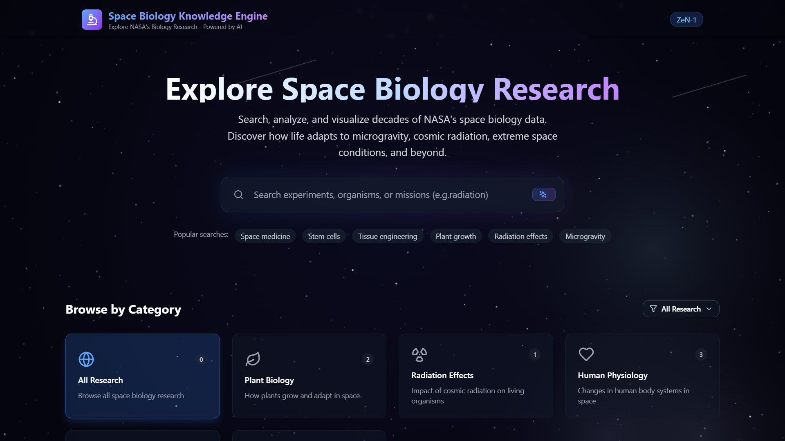
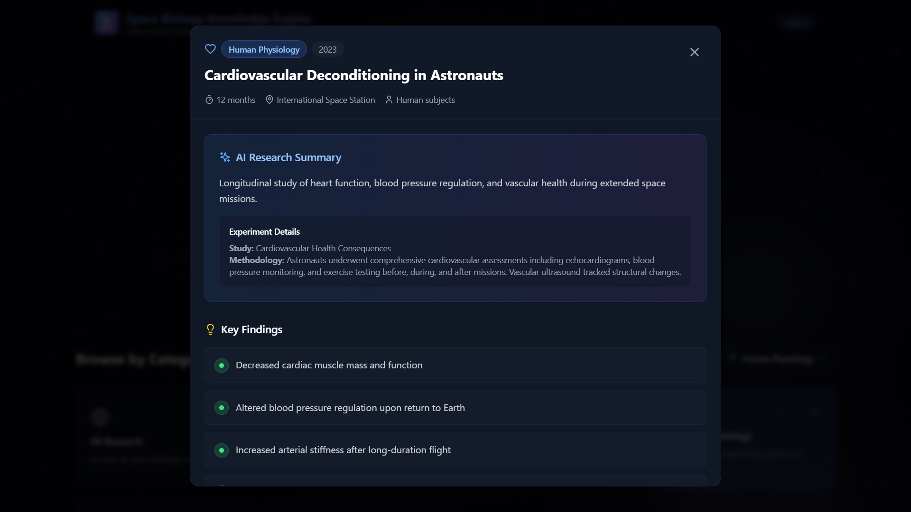

# 🚀 Space Biology Knowledge Engine


A modern, interactive web platform to **explore NASA's space biology research**, powered by AI. Browse decades of research on how life adapts to microgravity, cosmic radiation, and extreme space environments.  

Built for the **NASA Space Apps Hackathon 2025**.

---

## 🌌 Features

- **Dynamic Search**: Find experiments, organisms, missions, and keywords in real-time.
- **Category Filters**: Explore research by categories like Plant Biology, Radiation Effects, Human Physiology, Microbiology, and Cellular Biology.
- **Research Cards**: Clean, informative cards showing summary, year, keywords, and organism.
- **Detailed Research Modal**: AI-powered summaries, key findings, implications, and related studies in an interactive modal.
- **Visuals & UI**:
  - Starfield animated background
  - Glassmorphism-style cards
  - Responsive and modern dark theme
- **Popular Searches**: Quick access to trending space biology topics.

---

## 🛠 Tech Stack

- **Frontend Framework**: React 18 + TypeScript  
- **Styling**: Tailwind CSS, Glassmorphism UI effects  
- **Icons**: Lucide React  
- **Bundler**: Vite  
- **Deployment-Ready**: Optimized for modern browsers  

---

## 📥 Installation

Clone the repository:

```bash
git clone https://github.com/parmarth-kumar/space-biology-search-engine.git
cd space-biology-search-engine
````

Install dependencies:

```bash
npm install
# or
yarn
```

Run locally:

```bash
npm run dev
# or
yarn dev
```

Open the app at `http://localhost:5173/` (default Vite port).

---

## 🔍 Usage

* Use the **search bar** to filter research by experiment, organism, or keyword.
* Click **categories** to quickly browse research topics.
* Click a **research card** to view detailed AI summaries, findings, implications, and related studies.
* Hover over UI elements for subtle animations and tooltips.

---

## 🖼 Screenshots

| Home / Search                 | Research Modal                  |
| ----------------------------- | ------------------------------- |
|  |  |

---

## 🌐 Live Demo

Check out the live demo here: **[Space Biology Knowledge Engine](https://space-biology-search-engine.vercel.app/)**

---

## 🗂 Project Structure

```
space-biology-search-engine/
├─ src/
│   ├─ components/
│   │   ├─ SearchBar.tsx
│   │   ├─ CategoryFilter.tsx
│   │   ├─ ResearchCard.tsx
│   │   ├─ ResearchModal.tsx
│   │   └─ StarField.tsx
│   ├─ data/
│   │   └─ research-data.ts
│   ├─ App.tsx               # Main application component
│   ├─ main.tsx              # Entry point
│   └─ index.css             # Tailwind CSS styles
├─ index.html
└─ package.json

```

---

## 🎨 UI/UX Highlights

* **Glassmorphism** with blurred backgrounds
* **Animated starfield** for immersive space feel
* **Gradient highlights** on important UI elements
* Fully responsive across desktop and mobile

---

## 📈 Future Improvements

* Integrate **live NASA API** for up-to-date research.
* Add **user accounts** for saving favorite research.
* Implement **advanced AI summarization** for new research papers.
* Dark/Light mode toggle.

---

## 🤝 Contributing

Contributions are welcome!

1. Fork the repository
2. Create a new branch (`git checkout -b feature-name`)
3. Commit your changes (`git commit -m "feat: description"`)
4. Push to the branch (`git push origin feature-name`)
5. Open a Pull Request

Please maintain code readability and consistent styling with Tailwind CSS.

---
